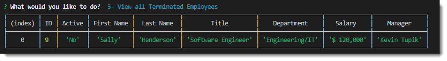

# Employee Tracker 1.0

### Unit 12 MySQL Homework: Employee Tracker

## Description

Use Employee Tracker to store your empployee information to ensure accurate data and easy payroll processing.

Access the git repo here: https://github.com/cbayley-edu/employee-tracker

How-to video: https://drive.google.com/file/d/1-vgqUyeOhCZgUyEftU3mpJajiOuTs7m4/view

## Table of Contents 

* [Installation](#installation)
* [Usage](#usage)
* [License](#license)
* [Questions](#questions)

## Installation 

To use the application you will need to install it locally, update the connection information to use your MySQL connection, and run the schema.sql and seed.sql in MySQL.

Using GitHub, clone or fork the repository. You'll need to get the repo pulled to your local repository. Once you have the repo locally, be sure to run npm install from your terminal to install inquirer and all other dependencies for the application. 

 

If you plan to push the repo back to your GitHub repo, be sure to add a .gitignore file to your root folder and ignore node_modules and .DS_Store/ . 

## Usage

Start the program by typing node employee-tracker.js in your terminal.

The program will start and present you with a list of options to select from. There are currently 17 options available - use your up/down arrow keys to see more. 

The database is comprised of Employees, Roles, and Departments. 

The user-friendly interface allows you to view records,

update records, 

and delete records. 

You also have options to view budget data by department and exit the program.

## License 

This project is covered by the above license(s). Click on the badge for more information.

## Questions 

GitHub username: cbayley-edu
GitHub profile link: https://github.com/cbayley-edu

Please email me at christinabayley@comcast.net with any questions you have or any issues you come across.

